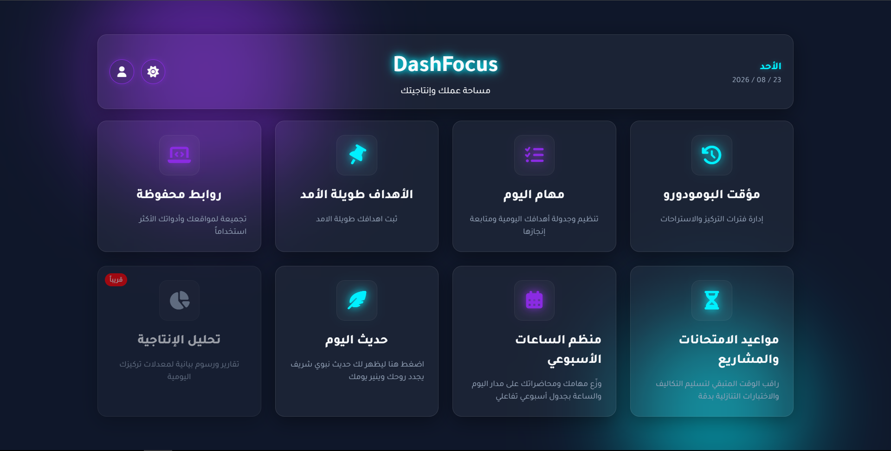

# DashFocus

🌐 **Live Demo:** https://zein-dev0.github.io/DashFocus/

## 📌 About
Help Students to Achieve More...

## ✨ Features
- 📝 Pomodoro Timer
- 📊 Daily Task List & Long-Term Goals Tracker
- 🎯 Weekly Schedule Planner & Exam Countdown 

## ️ Technologies Used
- HTML5
- CSS3
- JavaScript

## 📦 Installation
1. Clone the repo
2. Open index.html in your browser

## 📸 Screenshots

## 📬 Contact

**Zein Barbar**

- GitHub: [@zein-dev0](https://github.com/zein-dev0)
- Email: zeinbarbar0@gmail.com
- LinkedIn: [Your Profile](https://linkedin.com/in/your-profile)

**Project Link:** [DashFocus](https://github.com/zein-dev0/DashFocus)
